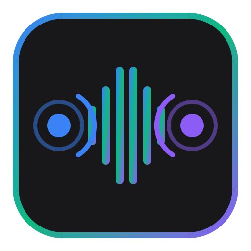

<p align="center">
  
</p>

<h1 align="center">Sonic Transfer</h1>

<p align="center">
  Direct browser-to-browser file transfer through sound.
</p>

<p align="center">
  <a href="https://arashtabaa.github.io/sonic-transfer/"></a>
</p>

<p align="center">
  
  
  
  
  
</p>

---

## Overview

Sonic Transfer enables two nearby devices (laptops, desktops, smartphones) to transfer files directly using their speakers and microphones.

- **No Wi-Fi or Bluetooth pairing required**
- **No WebRTC or WebSocket servers**
- **No cloud storage or user accounts**
- **No local network device discovery**
- **No QR codes or cables**
- **100% Serverless & Browser-Native**

The sender converts binary data into acoustic audio signals played over the speaker. The receiver listens through its microphone, demodulates the acoustic frames, verifies packet integrity via CRC32, reconstructs the file using Fountain codes, and presents the file for download.

---

## Quick Test (Two Devices)

To test file transfer between two devices:

1. **Open the application** on two nearby devices (e.g., Laptop & Phone).
2. On **Device A**, select **Send** and choose a small file (**1 KB – 10 KB** is recommended for your first test).
3. Select **Robust** or **Balanced** frequency mode.
4. On **Device B**, open **Receive** and grant microphone access when prompted.
5. Place the two devices near each other (~10–50 cm).
6. Click **Start Transmission** on Device A.

---

## Core Concept & Architecture

```text
SENDER DEVICE
Original File
     ↓
File Metadata (Filename, MIME type, Checksum)
     ↓
Fountain / Luby Transform Encoder
     ↓
Acoustic Packet Framing & CRC32
     ↓
Acoustic Modem Modulation (BFSK / MFSK / OFDM)
     ↓
Web Audio API / AudioWorklet
     ↓
Speaker Output

~~~~~~~~ AIR (Acoustic Sound Waves) ~~~~~~~~

RECEIVER DEVICE
Microphone Input
     ↓
Web Audio API / AudioWorklet Capture
     ↓
Acoustic Modem Demodulation
     ↓
Acoustic Frame Integrity Verification (CRC32 Check)
     ↓
Fountain Decoder (Web Worker)
     ↓
Original File Reconstruction & Checksum Validation
     ↓
User Blob Download
```

---

## Verification Status

We maintain strict and honest technical claims about the verification state of every subsystem:

### Verified Subsystems
- **Static Production Build**: Builds completely static assets (`.output/public`) deployable to static hosting.
- **Fountain Code Engine**: `packages/luby-transform` tested and verified for rateless block generation and decoding.
- **Frame Integrity**: Binary packet framing with 32-bit CRC validation rejects corrupted frames.
- **BFSK/MFSK Synthetic Round-Trip**: 100% byte-perfect reconstruction over synthetic software loopback tests.

### Experimental Subsystems
- **OFDM Multicarrier Modem**: Multicarrier OFDM modulation implemented; requires further channel equalization for noisy environments.
- **High-Throughput / Turbo Modes**: Functional in software; performance depends heavily on ambient acoustic conditions.
- **Near-Ultrasonic Modes**: Frequency band configuration supported; hardware response varies by device.

### Not Yet Physically Verified
- **Over-the-Air Physical Matrix**: Physical speaker-to-microphone over-the-air transfer bitrates across all hardware/browser matrix combinations are pending field measurement.
- **Universal Ultrasonic Support**: Ultrasonic frequency response (>18 kHz) depends on physical speaker/microphone hardware capabilities.

---

## Verified Synthetic Benchmark Results

The following result is from our automated test suite running a synthetic software loopback round-trip over 1,024 bytes of random binary data:

```text
--- SYNTHETIC ACOUSTIC ROUND-TRIP TEST ---
Test Type:            Synthetic (Software Loopback)
Modem Implementation: BFSKAcousticModem (MFSK Robust Profile)
Sample Rate:          48,000 Hz
Original SHA-256:      3fe708ab3133b3f87ebed89355d010c468d5dc811992c5b4f5ddeb6f239947c4
Reconstructed SHA-256: 3fe708ab3133b3f87ebed89355d010c468d5dc811992c5b4f5ddeb6f239947c4
Exact Byte Equality:   PASS (100% Identical)
------------------------------------------
```
*(Note: Synthetic benchmark results do not represent physical over-the-air performance).*

---

## Frequency Profiles

| Profile | Target Use Case | Frequency Band | Status |
| :--- | :--- | :--- | :--- |
| **Auto** | Automatic calibration | Measured via probe sweep | Implemented |
| **Robust** | Maximum compatibility | 1.5 kHz – 3.5 kHz | Implemented |
| **Balanced** | General use (Default) | 2.0 kHz – 6.0 kHz | Implemented |
| **Turbo** | High throughput | 3.0 kHz – 12.0 kHz | Experimental |
| **Near-Ultrasonic** | Reduced audible sound | 15.0 kHz – 19.5 kHz | Experimental |
| **Ultrasonic** | Hardware-dependent | 18.0 kHz – 22.5 kHz | Experimental |
| **Custom** | Expert tuning | User-configured | Implemented |

---

## Why Fountain Codes?

Acoustic audio channels are inherently lossy and subject to ambient noise, reflections, and dropped audio frames (a Binary Erasure Channel).

Instead of requiring retransmission of lost packets via network handshakes, Sonic Transfer uses **Luby Transform (Fountain Codes)**. The sender continuously broadcasts random XOR combinations of original file blocks. The receiver collects any valid blocks (in any order) until it has enough data to reconstruct the exact original file.

---

## Privacy & Security

- **100% Local Processing**: All encoding, modulation, microphone capture, demodulation, and decoding happen locally inside your web browser.
- **No Cloud Upload**: File data is never sent to any server or cloud service.
- **Untrusted Input Handling**: Received files are treated strictly as untrusted binary blobs and are never automatically executed or evaluated.

---

## Developer Quick Start

### Prerequisites
- Node.js >= 18
- pnpm >= 9

### Local Setup & Development
```bash
git clone https://github.com/arashtabaa/sonic-transfer.git
cd sonic-transfer

# Install dependencies
pnpm install

# Run workspace builds
pnpm packages:build

# Start dev server
pnpm dev

# Run test suite & typecheck
pnpm test --run
pnpm typecheck

# Generate static production build
pnpm generate
```

The production static build is generated in `.output/public/`.

---

## One-Click Windows Launcher

For offline local usage on Windows:

1. Download or clone the repository.
2. Double-click `start.bat` (or run `./start.ps1` in PowerShell).
3. The script will automatically build static assets if needed, start a local HTTP server, and open your browser at `http://localhost:3000`.

---

## Documentation

Detailed architectural and technical specifications are available in the `docs/` directory:

- [Architecture Overview](docs/architecture.md)
- [Acoustic Protocol & Framing](docs/acoustic-protocol.md)
- [Modem Architecture & Profiles](docs/modem.md)
- [Testing & Benchmarking Guide](docs/testing.md)

---

## Inspiration & Attribution

Sonic Transfer is derived from and inspired by [qrs](https://github.com/qifi-dev/qrs) by LittleSound / qifi-dev.

Qrs pioneered rateless file streaming over visual animated QR code sequences using Luby Transform fountain codes. Sonic Transfer adapts this transport architecture from the visual optical spectrum to the acoustic audio spectrum while preserving `packages/luby-transform`.

### License
Sonic Transfer is open-source software licensed under the [MIT License](LICENSE). Retains original copyright notices for derived Fountain code components.
